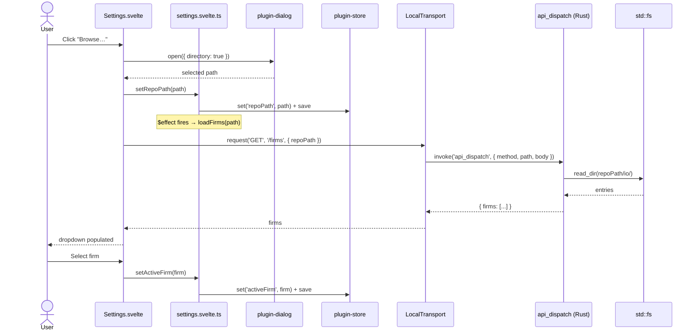

# Changelog - 2026-04-27 (02)

## Settings + Firm Picker — First End-to-End Through the Transport Layer

## Why Care?

**For the firm (Mike):** This is the first vertical slice through the architecture we speced in `Transport-Contract-and-API-Conventions.md`. The proof points that matter:

- The Transport seam is real, not theoretical. `LocalTransport.request('GET', '/firms', { repoPath })` calls `invoke('api_dispatch', ...)` in Rust, the dispatcher routes by `(method, path)`, the Rust handler reads `{repoPath}/io/` and returns JSON. Same shape today (IPC) as tomorrow (HTTP/SSE) — the day we stand up a FastAPI server, only the transport implementation changes; every Svelte component is unaffected.
- Svelte 5 runes work for class-based state. `class SettingsState { repoPath = $state(...) }` in a `.svelte.ts` file gives us reactive instances that components can subscribe to without ceremony. The pattern carries to every future store.
- Persistence is a one-liner. `@tauri-apps/plugin-store` writes to the OS-correct app data dir; reading on load and writing on every `set*` keeps disk and memory in sync. No SQLite, no IndexedDB, no custom serializer.
- The architectural cost of "do it right" was small. ~250 lines of new code total — three TypeScript files for transport, one runes store, one Svelte component, three Rust files for the API module. None of it is throwaway.

**For end users (VCs eventually):** Without telling the app where the orchestrator lives and which firm you're working under, nothing else can run. This screen is the entrance ramp. It's deliberately minimal — pick a folder, pick a firm, done — because every subsequent feature inherits "active firm" from here and stops asking the user the same question repeatedly. Future actions like "Generate Memo" reduce to (firm, deal, version), not a wall of flags.

---

## What landed

### Transport layer (the seam)

A small TypeScript abstraction the rest of the frontend codes against:

```ts
// src/lib/transport/types.ts
export type HttpMethod = 'GET' | 'POST' | 'PUT' | 'DELETE';

export interface ApiError {
  status: number;
  code: string;
  message: string;
  details?: unknown;
}

export interface Transport {
  request<T = unknown>(method: HttpMethod, path: string, body?: unknown): Promise<T>;
}
```

`LocalTransport` is the implementation for desktop mode — every call funnels through a single Tauri command:

```ts
// src/lib/transport/local.ts (excerpt)
export class LocalTransport implements Transport {
  async request<T>(method: HttpMethod, path: string, body?: unknown): Promise<T> {
    try {
      return await invoke<T>('api_dispatch', { method, path, body: body ?? null });
    } catch (e) {
      if (typeof e === 'object' && e !== null && 'status' in e && 'code' in e) {
        throw e as ApiError;
      }
      throw { status: 500, code: 'transport_error', message: String(e) } satisfies ApiError;
    }
  }
}
```

A `getTransport()` factory hands out a singleton. When the day comes to flip to HTTP, the factory checks a setting and returns `HttpTransport` instead. No component knows or cares.

### Rust dispatcher (one route, room for many)

A single `#[tauri::command] pub async fn api_dispatch(method, path, body)` routes by `(method, path)` to typed handlers. The first route is `GET /firms`:

```rust
// src-tauri/src/api/router.rs
#[tauri::command]
pub async fn api_dispatch(
    method: String,
    path: String,
    body: Option<Value>,
) -> Result<Value, ApiError> {
    match (method.as_str(), path.as_str()) {
        ("GET", "/firms") => {
            let repo_path = body
                .as_ref()
                .and_then(|b| b.get("repoPath"))
                .and_then(|v| v.as_str())
                .ok_or_else(|| ApiError::validation("repoPath required"))?;
            queries::list_firms(repo_path).await
        }
        _ => Err(ApiError::not_found(&path)),
    }
}
```

`list_firms` reads `{repoPath}/io/` via `std::fs::read_dir`, filters to directories, sorts, and returns `{ "firms": [...] }`. Crucially, it doesn't go through the `tauri-plugin-fs` scope system — Rust has full filesystem access by default; the plugin's allowlist is only relevant when JS reads files directly. This is the cleaner pattern long-term: data queries originate from Rust, plugins are user-side affordances (file pickers, persistent stores).

### Settings store (Svelte 5 runes, persisted)

```ts
// src/lib/stores/settings.svelte.ts (excerpt)
class SettingsState {
  repoPath = $state<string | null>(null);
  activeFirm = $state<string | null>(null);
  loaded = $state(false);

  #store: Store | null = null;

  async load() {
    if (this.loaded) return;
    this.#store = await Store.load('settings.json');
    this.repoPath = (await this.#store.get<string>('repoPath')) ?? null;
    this.activeFirm = (await this.#store.get<string>('activeFirm')) ?? null;
    this.loaded = true;
  }

  async setRepoPath(path: string | null) {
    const changed = path !== this.repoPath;
    this.repoPath = path;
    if (changed) {                          // repo changed → invalidate firm
      this.activeFirm = null;
      await this.#store?.delete('activeFirm');
    }
    /* …write to store, save… */
  }
}

export const settings = new SettingsState();
```

Two non-obvious decisions:
- `loaded` is its own rune so components can `$effect(() => { if (!settings.loaded) settings.load() })` and re-render when it flips true. Avoids races.
- Changing `repoPath` clears `activeFirm`. A firm picked under one repo won't necessarily exist under another; the dropdown re-fetches from the new path.

### Settings UI

One Svelte component (`src/lib/components/Settings.svelte`) wires everything. Two `$effect` blocks: one boots the store on mount, the other re-fetches firms whenever `repoPath` changes. The Browse button calls `@tauri-apps/plugin-dialog`'s `open({ directory: true })`. The firms dropdown is populated by `getTransport().request('GET', '/firms', { repoPath })`. Selecting a firm calls `settings.setActiveFirm()`. That's it.

---

## Request flow, end to end



Three layers, one line of communication between each. No back-channels, no shortcuts.

---

## Architectural decisions worth recording

### Why a single `api_dispatch` Rust command instead of one command per route?

- The frontend talks to the same code path it will use over HTTP later — `request(method, path, body)`. That's the whole point of the abstraction.
- Adding a new route is `match (method, path) { … }` in Rust + a Python entry point. No new Tauri command registration ceremony per route.
- The dispatcher is the natural seam where you'd later swap to actual HTTP if you wanted to host the server externally.

### Why Rust does the directory read, not the `fs` plugin?

The `tauri-plugin-fs` plugin is for cases where the **frontend JavaScript** needs direct filesystem access — its scope/allowlist system protects users from a compromised webview. But our queries always originate from Rust (`api_dispatch` → handler), and Rust has unrestricted filesystem access by design. Routing user-path reads through the plugin would mean managing a runtime scope allowlist that has to keep up with whatever path the user picks. Skipping the plugin for query handlers is simpler and more secure.

The `fs` plugin is still installed and capable — we'll use it from JS only if and when there's a clear reason (e.g., showing a file's contents in a preview pane without round-tripping through Rust).

### Why GET requests carry a body in local mode?

Spec correctness would say `GET /firms?repoPath=...` (query parameters). Local mode is forgiving — there's no real HTTP layer, just a Tauri IPC call — so passing parameters in the body keeps the Transport interface uniform across methods. When `HttpTransport` lands, GETs that need parameters get translated to query strings. This is documented as a local-mode shortcut, not a contract on the Transport interface itself.

---

## Skipped on purpose

- **`shell` plugin usage.** No actions yet — only a query. The first `POST /actions/...` route lights up the shell plugin (spawning the Python orchestrator) and forces the streaming/job-event model to materialize.
- **Legacy `data/{Company}.json` mode.** GUI is firm-scoped only, by decision. The orchestrator's `paths.resolve_deal_context()` still supports legacy mode for direct CLI use; the GUI does not.
- **Visual polish.** Functional CSS only. The page knows light/dark mode via `prefers-color-scheme`. Spacing, typography, branding are placeholders — they slot in once we adopt the `@memopop/shared-styles` package's tokens.
- **Multi-firm settings.** Today it's one active firm at a time. A future iteration may show recents or pin favorites.

---

## Next

- **First action: `POST /actions/recompile-memo`.** Cheapest and fastest action (seconds), low blast radius, exercises `shell` plugin + the streaming/job-event model. Becomes the template for `improve-section`, `generate-memo`, and the rest.
- **Sidebar layout.** Move from the single Settings page to the three-region layout from the Tauri spec: sidebar of action categories, main pane for parameter form + status, log pane below. Settings becomes a sidebar item.
- **Action catalog wiring.** Load `gui_actions.json` from the orchestrator repo (or bundle a copy) so the action list is data-driven, per the spec.
